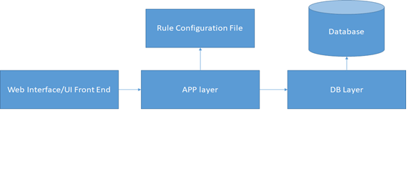
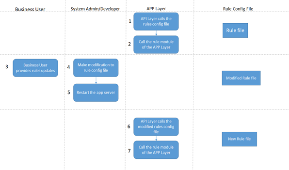
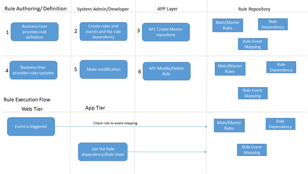
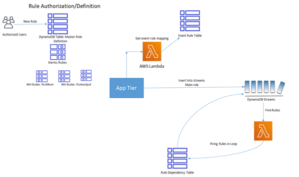

## Building a Simple Rule Engine using AWS Lambda and DynamoDB

**Background:**

The rules engine use semantics similar to if/then statements found in your favorite programing language to evaluate data against predetermined conditions before arriving at a decision. Example, could be financial systems adjustment to market dynamics and consumer behavior in real time.  They process vast amounts of data and using robust rules engines make critical decisions without the end user ever noticing.   Each transaction flows through a set of complex rules and conditional checks before an action can be taken.

**Purpose:**

This guide helps to implement a simple rule engine frameowrk and how to externalize rules stroing in DynamoDB and finally use Lambda and DynamoDB stream to fire those rules.

**Introduction:**

Traditionally, the rules guiding the decision process were hardcoded in the software, making it difficult to quickly adopt to changing business needs.  More recent systems use configuration files to provide some level customization but made the system more difficult to maintain at scale. 

The main components involved in the rule engine framework could be depicted as per the below diagram



The Main steps and flow involved as per the above framework are depicted below



To improve these systems system designers developed rule engine frameworks that allow for better flexibility, shorter deployment cycles and simpler manageability at scale. The following diagram shows a simple rules engine design.  Rules are defined by the business and implemented by engineers using a set of tools provided by the rule engine framework.  The engineers and analysts continuously update and optimizes these rules to yield the best outcome for the customer and the business.

The main steps in executing rule engine are

1)	An Engineer using a rule authoring tool creates a rule object comprised of relevant business and technical parameters getting inputs from Data Model. Business Analyst uses the Rules authoring tool to create rules on these objects .
2)	Rules that have been created and are published and stored in a central repository.  
3)	Rules rarely stand alone.  Typically rules will be chained together in a dependency hierarchy that enable the user to describe complex business conditions.
4)	Rules may be staged either client or server side.  Each has its own set of pros and cons, but the industry is moving toward server side hosting due to flexibility and cost savings.
5)	The rules engine would execute the flow, including its dependencies and associated parameters.

Lets elaborate the same using credit card credit check rules example as below with a process flow
The perquisite step is to identify the Model Objects, which are called the Rule Objects needed to execute the rules. In the credit card example case it would the Credit Card, Account, Customer, Transaction objects. And then create rules on these objects. Lets create a simple rule for credit card. 

General Rule object template would be like this
Object Name{
Object field1:
Object field2:
Etc ……
}

In this case as it is CreditCard we can name it as CreditCard Object

CreditCard{
CreditCardName:
CreditCardExpDate:
CreditCardLocation:
CreditCardPoints:
}

The object parameters would have comparison values for these fields and rules could be and /or of these fields comparison.
For example Rule 1 could be like this CreditCard.Location == India and CreditCard.Points ==100 then Discount Value is 10%.
Then next rule could be CreditCard.ExpDate < Nov 2025 and CreditCard.Location in Bangalore then Discount is 10%

Rule flow chart could be as below
For example


The diagram above demonstrates how to arrive at a decision whether a grower is covered by the Produce Rule.  There are several conditional rules that determine the outcome.  A rules engine will encode the questions at each step as rules with a binary, true or false, outcome that will lead to the next rule until a decision is made.

**A decoupled rules engine**

To overcome the challenges where parameters and dependencies are hardcoded, we need to decouple the execution engine from the rule definition, dependencies and configuration parameters.  
The most critical features in Decoupled Rule engine as MVP are
1)	Robust Rule Authorization and Rule Editing
2)	Rich  Business interface with workflow management
3)	 Intelligent Rule engine to apply the filter and predicates or skip conditions. 
4)	Rule versioning/history and Rule Maintenance
5)	Rule Execution – Simple and Complex Rules ( Rule chaining )


This Guide provides a high level overview of the above points and an implementation and framework example for Simple Rule Execution. 

**Architecture**

Combining the advantages of Decoupled Rule Engine, let’s see how that can be achieved by using the server less technologies on AWS. 
 The below steps provide guideline and a high level framework for Rule Authoring and Rule Execution



The below is an architecture to implement the execution of Simple Rule Execution



We chose to use Amazon DynamoDB, a fully managed and highly scalable key/value store, to hold our rule definition, dependencies and the results of executing each rule.  We also chose to use AWS Lambda, a serverless execution environment giving users choice in programing language and complexity of the rule’s logic. Event generation is mimicked using inserts into the streams table which initiates the Rule execution.

**Steps in Rule Execution **

1)	Rule Authorization is done by System Admin, Business user would provide the values and the rules can be created into the Main Rule table by System Admin.
2)	Event triggered in the APP layer could be initiation of the rule flow. For example events could be, debit in the account or transfer of amount from account. These could be the types of events. Each of the event could be associated with rule and can trigger a rule flow. 
3)	The Main rule table consists of all the rules and rule chain/dependency. 
4)	Based on the event and rule combination, the rule is selected which needs to be triggered.  The event in the second step would decide which rule to be executed. This is stubbed using a direct insert into streams table which triggers the entire rule execution flow, which is carried out in the next step.
5)	The triggering of the rule happens through insertion into DynamoDB Streams Table.
6)	An entry is made into the streams table with the rule number based on the event rule dependency. In this it’s a simple write to table, which can be later integrated and encapsulated as a module to trigger this rule flow.
7)	A new stream record is written .
8)	New stream record triggers lambda (firerule)
9)	The lambda logic is as below
Get the rule number from stream record.
Execute the rule searching in rules table
Output execution in execution table.
Search in dependency and write next entry into streams table.
If there dependency table as stop, don’t write any entry into streams table and write to final output table.
Write to final output table which is streams enabled.
10)	Final output stream triggers lambda (sendOutput)

**SetUp**

The first thing we need to do is setup a few tables in DynamoDB.

Rules table
Using the AWS CLI create the rules table as follows:

aws dynamodb create-table     --table-name RuleTable     --attribute-definitions AttributeName=RuleNum,AttributeType=S AttributeName=Code,AttributeType=S AttributeName=Lang,AttributeType=S     --key-schema AttributeName=RuleNum,KeyType=HASH AttributeName=Code,KeyType=RANGE     --provisioned-throughput ReadCapacityUnits=5,WriteCapacityUnits=5

This table has three attributes, 1) a rule number which is a unique identifier for this rule, 2) function name or URL path which points to a file on Amazon S3 containing rule logic to execute and 3) the programing environment to instantiate on AWS Lambda when executing the rule.
For example:

1 , func1 , nodejs
2 , func2 , nodejs
3 , s3://bucket/rules/python/rule3.py , python

Dependency table
Lets use the AWS CLI again to create a table that will hold the dependencies between the rules

aws dynamodb create-table     --table-name DepTable     --attribute-definitions AttributeName=RuleNum,AttributeType=S AttributeName=Output,AttributeType=S     --key-schema AttributeName=RuleNum,KeyType=HASH AttributeName=Output,KeyType=RANGE      --provisioned-throughput ReadCapacityUnits=5,WriteCapacityUnits=5

This table also has three attributes, 1) a rule number representing the rule to execute first, 2) a boolean condition representing the results of executing the rule and 3) the number of the next rule to execute if the condition is met.  The next rule to execute may also be a stop keyword that will result in terminating the rule execution.

For example:
1 , success , 2
1 , failure , 3
2 , success , stop
2 , failure , stop
3 , success , stop

Streaming table
This is a DynamoDB streams table where the first rule gets inserted and then would trigger the lambda function which can complete the rule cycle by reading from the above dependency table and execute the rule cycle. 

Sample entry to stream table could be 

3					func1						nodejs

Results table
The Lambda would record the values for the rules and rules executed into this table. This table would work like an audit table to record the rules output.
1				Executed					success
3				Executed					failure
4				Rerun						success


**Rules execution**

Now that the different tables have been created we need to define our AWS Lambda environment that will consume our rules, execute them and update the results back to the results table in DynamoDB.
Create a file on your local machine called trust-relationship.json and paste in the following statement:

```
{
   "Version": "2012-10-17",
   "Statement": [
     {
       "Effect": "Allow",
       "Principal": {
         "Service": "lambda.amazonaws.com"
       },
       "Action": "sts:AssumeRole"
     }
   ]
 }    

```


## Security

See [CONTRIBUTING](CONTRIBUTING.md#security-issue-notifications) for more information.

## License

This library is licensed under the MIT-0 License. See the LICENSE file.

